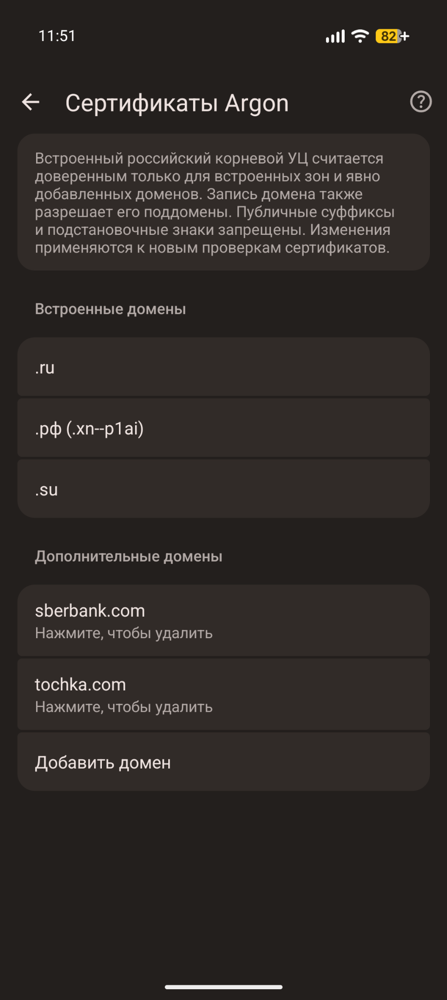
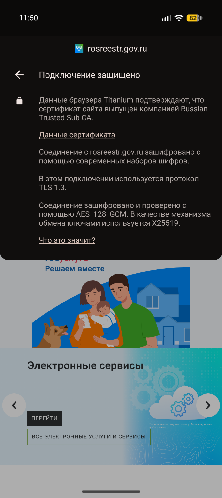
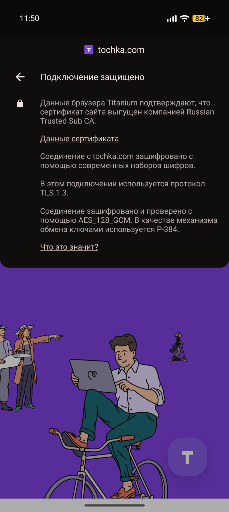

# Argon

Android-браузер на базе Titanium и Chromium с поддержкой расширений Chrome и сайтов, использующих российский корневой сертификат.

**[Скачать последнюю версию](https://github.com/Loopfade/argon/releases/latest)** · [Сообщить об ошибке](https://github.com/Loopfade/argon/issues/new/choose)

## Возможности

- **Расширения Chrome на Android.** Устанавливайте из Chrome Web Store блокировщики рекламы, переводчики и другие дополнения прямо на телефон. Chrome для Android не поддерживает их запуск. Argon также поддерживает Manifest V2 — старый формат расширений, от которого [Google Chrome отказался](https://developer.chrome.com/docs/extensions/develop/migrate/mv2-deprecation-timeline).
- **Российские сертификаты для `.ru`, `.рф` и `.su` без установки в Android.** Для этих зон, например `rosreestr.gov.ru`, доверие к встроенному российскому корневому УЦ уже разрешено. Его сертификат входит в Argon, поэтому вручную добавлять его в системное хранилище устройства не требуется.
- **Доверие для выбранных сайтов в других зонах.** Добавьте нужный домен, например `example.com`, в **Сертификаты Argon**, чтобы разрешить использование сертификатов этого УЦ для выбранного сайта и его поддоменов, например `www.example.com`. Так можно пользоваться нужными сайтами, сохраняя ограничение доверия к этому УЦ для остальных доменов.

## Скачать и установить

Для текущих сборок требуется **Android 10 или новее** и устройство с ARM-процессором.

1. Откройте [последний релиз](https://github.com/Loopfade/argon/releases/latest) и разверните список **Assets**.
2. Выберите APK для своего устройства:

| Файл APK | Для какого устройства |
| --- | --- |
| `…-release-arm64-v8a.apk` | Устройства с 64-битной версией Android — большинство современных телефонов |
| `…-release-armeabi-v7a.apk` | Устройства с 32-битной версией Android на ARM |

3. Откройте скачанный APK. Если Android запросит разрешение на установку из этого источника, предоставьте его и завершите установку.

Для обновления скачайте APK нового релиза для той же архитектуры и установите его поверх текущей версии. Рядом с каждым APK опубликован файл `.sha256` для проверки целостности загрузки.

## Расширения

1. Откройте [Chrome Web Store](https://chromewebstore.google.com/) в Argon.
2. В меню **⋮** включите версию сайта для компьютера.
3. Найдите расширение и подтвердите его установку.

Управлять установленными расширениями можно на странице `chrome://extensions`. Там же можно включить режим разработчика и загрузить распакованное расширение из папки.

Расширения Manifest V2 больше не доступны в Chrome Web Store. Для них используйте загрузку распакованного расширения, полученного от его разработчика.

Для работы расширения в режиме инкогнито откройте его сведения и включите соответствующее разрешение. Совместимость конкретного расширения с мобильным интерфейсом может различаться.

## Российские сертификаты

По умолчанию Argon доверяет встроенному российскому корневому удостоверяющему центру для сайтов в зонах **`.ru`, `.рф` и `.su`**. У каждой зоны есть отдельный переключатель: её можно выключить, сохранив запись на экране. Для выбранных доменов доверие можно разрешить отдельно в настройках.

Откройте **Настройки → Конфиденциальность и безопасность → Сертификаты Argon**.

Чтобы вести только свой список, выключите все встроенные зоны и добавьте нужные домены. Если все зоны выключены и список пуст, доверие к этому УЦ полностью отключено. Это также действует, если тот же корневой сертификат установлен в Android. Сертификаты других доверенных УЦ проверяются по обычным правилам.

### Пересечения правил доверия

Новый домен нельзя добавить, если его уже покрывает включённая зона или существующая запись. Например, при включённой `.ru` нельзя добавить `bank.ru`, а запись `example.com` уже покрывает `www.example.com`.

Если включить зону или добавить родительский домен, уже сохранённые записи не удаляются. У покрытых записей появляется отдельный значок **!**. Нажмите его, чтобы увидеть все покрывающие правила и последствия изменения или удаления записи. Значок означает избыточность правила, а не ошибку сертификата.

После выключения или удаления всех покрывающих правил значок исчезнет, а сохранённая запись будет обеспечивать доверие самостоятельно. Удаление покрытой записи не отключает доверие, пока действует другое покрывающее правило.

<table>
  <tr>
    <td align="center"></td>
    <td align="center"></td>
  </tr>
  <tr>
    <td align="center">Встроенные зоны и список дополнительных доменов</td>
    <td align="center">rosreestr.gov.ru — пример сайта в зоне .ru</td>
  </tr>
</table>

### Добавление доменов

1. В разделе **Сертификаты Argon** нажмите **Добавить домен**.
2. Введите имя сайта, например `example.com`, без `https://`, пути и порта.
3. Подтвердите добавление.

Запись разрешает доверие этому УЦ для указанного домена и его поддоменов. Например, `example.com` также охватывает `www.example.com`. Изменения применяются к новым проверкам сертификатов.

На скриншоте ниже показано защищённое соединение с сайтом, домен которого добавлен пользователем. Этот домен не входит во встроенный список.

<table>
  <tr>
    <td align="center"></td>
  </tr>
  <tr>
    <td align="center">Соединение с добавленным доменом</td>
  </tr>
</table>

Чтобы удалить дополнительный домен, нажмите на его запись и подтвердите удаление. IP-адреса, подстановки вроде `*.example.com` и публичные суффиксы вроде `.com` добавлять нельзя. Добавление домена не отключает остальные проверки сертификата.

Проверяются все доменные имена внутри сертификата: если он содержит разрешённый и неразрешённый домены, доверие отклоняется. Это может потребовать дополнительных записей при использовании узкого списка.

## Помощь и обратная связь

Нашли проблему? [Создайте issue](https://github.com/Loopfade/argon/issues/new/choose) и укажите версию Argon, версию Android, модель устройства и шаги для повторения ошибки.

## О проекте

Argon основан на [Titanium](https://github.com/jqssun/android-titanium-browser) и [Chromium](https://www.chromium.org/). Поддержка российского сертификата адаптирована из [Ruthenium for Android](https://github.com/rutheniumteam/ruthenium-android).

[Лицензия Argon](https://github.com/Loopfade/argon/blob/main/LICENSE) · [Лицензия Ruthenium](https://github.com/Loopfade/argon/blob/main/licenses/Ruthenium-BSD-3-Clause.txt) · [Сборка и проверки](https://github.com/Loopfade/argon/blob/main/VALIDATION.md)
